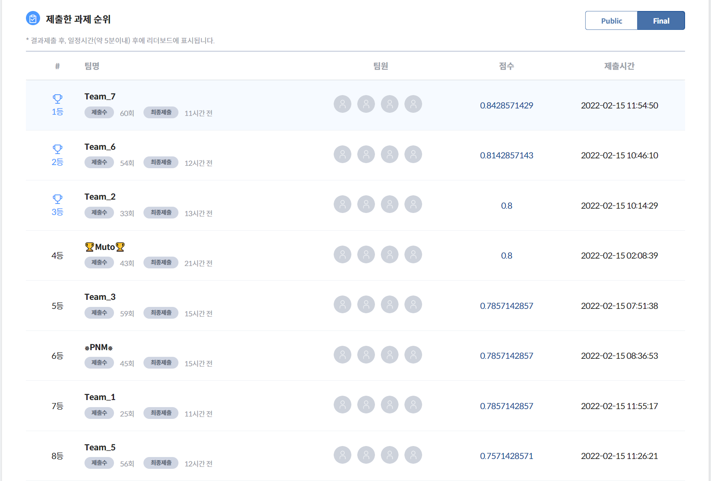

# 흉부 CT 코로나 감염 여부 분류

주최: 중소벤처기업진흥단|마인즈앤컴퍼니

## 과제 개요

흉부 CT 코로나 감염 여부 분류 모델
이미지 영역|개방형 문제|Accuracy

### 문제 정의

- 흉부 CT 이미지를 이용해 코로나19감염 여부를 이진 분류

### 추진 배경

- 코로나 펜데믹 도래와 장기화에 따른 코로나 확진자 분류 필요성 증대
- 의료 이미지 AI기술 적용 가능성 확대

자세한 사항은 아래 링크에 확인 할 수 있습니다.

[AI CONNECT](https://www.aiconnect.kr/main/competition/detail/204/task/212/assignmentinfo)

### 정리

베이스라인은 CNN기본 모델을 기준이다.
wandb를 통해 train score, train loss, val score, val loss가 어떻게 변화되는지 시각적으로 확인을 통해 팀원들과 공유를 하였고, 어떻게 훈련을 시킬 것인지 매번 토론을 하였다.

[wandb레퍼지토리](https://wandb.ai/tkddn2075/Image%20Augmentation?workspace=user-tkddn2075)

[PyTorch 이미지 분류 모델](https://pytorch.org/vision/stable/models.html)
1.image classification model가 많기 때문에, 다른모델들을 다 돌려본 결과, train데이터가 적기 때문에 과적합이 일어남 -> 데이터 수를 늘려주기 위해서 augmentation을 진행

2. VGG가 가장 Score가 좋게 나옴

3. 하이퍼 파라미터 튜닝을 위해 learning rate, input_size 등 조절을 해봄(베이스라인으로 주어진 기본이 가장 좋아서 바꾸지 않음)

4. Epoch수도 늘려가면서 다양하게 돌려봄

다양한 augmentation을 진행 해보았고, 아래 링크를 통해서 좀더 자세하게 살펴볼 수 있다.
[MUTO(8팀)노션](https://www.notion.so/f31dcee0e47241e5b5809f9cf811bfda?v=020701f6b5f145b3892c1c7d1bb17bf7)

아래 사진처럼 정말 다양하게 돌려보았다.

결론: 순위별로 팀이 이루어졌고, 저희팀은 하위권 팀이였지만, 팀전 첫번째 프로젝트 때 공통 3위라는 쾌거를 이루게 되었다.

